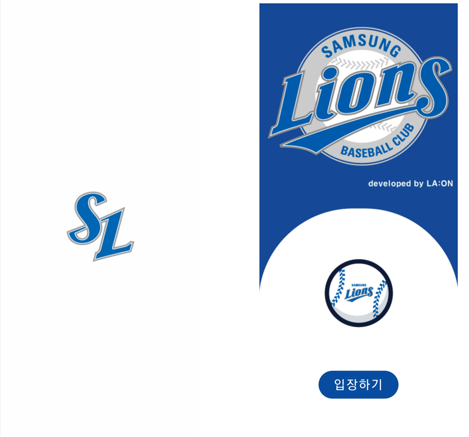
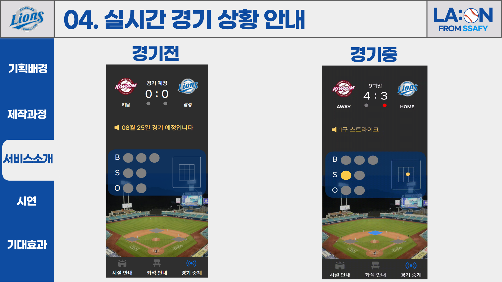
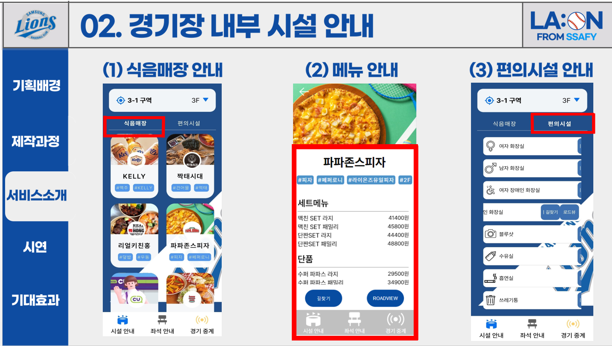
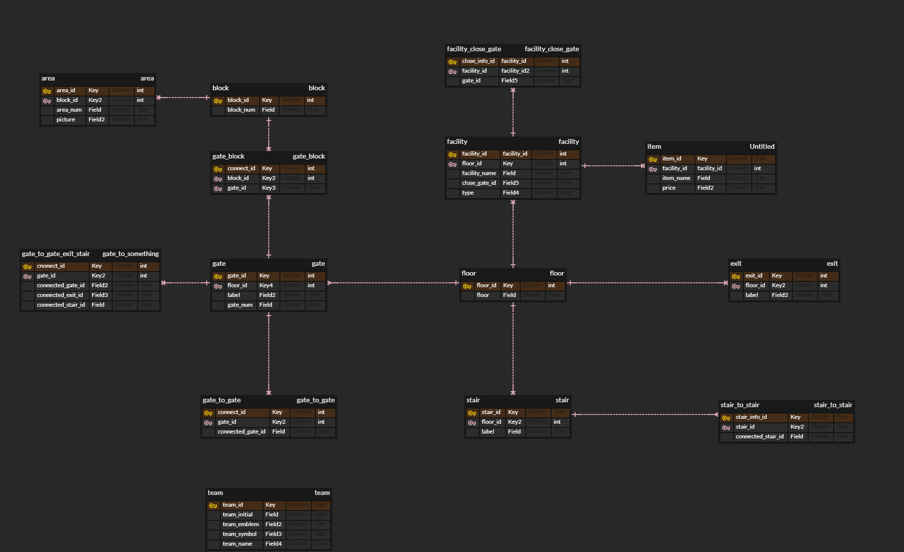
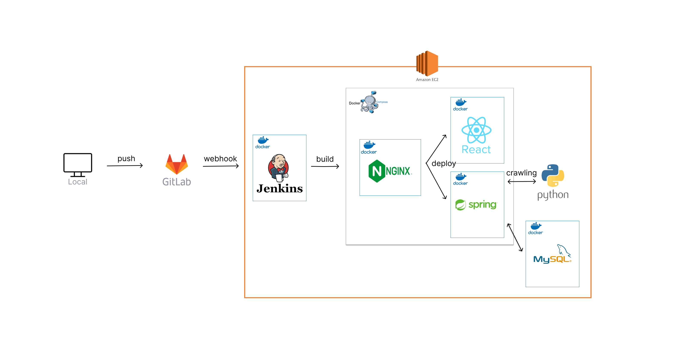

 

#### 삼성 라이온즈 파크 서비스

#### 삼성 라이온즈 파크 직관러들을 위한 맞춤 서비스

 

## 🗒️ 목차

1. [👨‍👩‍👧‍👦 팀원 소개](#👩‍👩‍👧‍👦-팀원-소개)
2. [📝 프로젝트 개요](#📝-프로젝트-개요)
3. [💡 주요 기능](#💡-주요-기능)
4. [⚙️ PrtingManual](#⚙️-prtingmanual)

 

## 👩‍👩‍👧‍👦 팀원 소개

#### 🧑‍💻 <strong>이상훈</strong> - 팀장, BE

#### 🧑‍💻 <strong>곽은정</strong> - FE

#### 🧑‍💻 <strong>김대웅</strong> - FE

#### 🧑‍💻 <strong>김태환</strong> - BE

#### 🧑‍💻 <strong>손민영</strong> - FE

#### 🧑‍💻 <strong>정근모</strong> - BE

 

## 📝 프로젝트 개요

- <strong>진행 기간</strong>: 2023.07.10 ~ 2023.08.18

- <strong>목표</strong>
  
  - 삼성 라이온즈 파크 관련 서비스를 제공합니다.
  
  - 삼성 라이온즈 파크 직관러들을 위한 정보를 제공합니다.
    
     

## ✍️ 프로젝트 소개

“<strong>라온</strong>”은 삼성 라이온즈 파크에 방문하는 직관러들을 위한 서비스 제공 어플리케이션/웹 서비스 입니다.

 

- <strong>직관 전</strong>
  - 세분화된 구역별 시야를 파노라마 사진을 통해 제공합니다.
  - 다음 경기에 맞는 예매 사이트 이동 서비스를 제공합니다.
  - 구장 내 모든 식음매장 정보 및  가게 별 메뉴를 제공합니다.
  - 다가오는 삼성 라이온즈 파크 경기의 날짜, 상대 팀 정보를 제공합니다.

 

- <strong>직관 중</strong>
  - 실시간 중계 서비스를 통해 이닝, 스코어, 볼카운트, 문자중계, 스트라이크존을 제공합니다.
  - 원하는 식음매장 및 편의 시설 클릭 시, 현 위치를 기반으로 최단 경로를 네비게이션, AR을 통해 안내합니다.

 
 

## 💡 주요 기능

### 랜딩/메인페이지

 

- 입장하기 버튼을 통해 앱을 시작합니다.
- 경기중일때 경기중계화면으로, 경기중이 아닐때는 좌석 안내페이지로 이동합니다.

 

### 기능페이지

> 좌석 안내

        

- 다음 삼성 라이온즈 파크에서의 어웨이 팀을 제공하고, 그에 알맞는 구역별 시야를 파노라마 형태로 제공합니다.
- 해당 경기에 맞는 예매 사이트 이동 서비스를 제공합니다.
- 파노라마 아래 세분화된 구역을 통해 더욱 다양한 시야를 제공합니다.

 

> 경기중계

    

- 경기전의 경우, 삼성 라이온즈 파크 경기가 있는 날의 경기 정보를 알려드립니다.

- 경기중일 경우, 어웨이팀, 이닝, 점수, 문자중계, 볼카운트, 출루정보 그리고 스트라이크 존을 제공합니다.
  
   

> 시설안내

        

- 구장 내 식음시설, 메뉴, 편의시설을 안내합니다.

 

        

- 최적의 경로를 알려주는 네비게이션과 AR을 통해 식음시설과 편의시설까지의 길안내를 제공합니다.

 

## :chart_with_upwards_trend: ERD

 

## :open_file_folder: 시스템 아키텍처

 

## :wrench: 기술 스택

### Front-end

`React` `JavaScript` `Redux` `AR.js` `HTML5` `CSS`

### Back-end

`JAVA` `Spring Boot` `JPA` `MySQL`

### 협업 Tool

`JIRA` `GitLab` `Notion` `MatterMost`

 

## ⚙️ PrtingManual

[⚙️ PrtingManual](https://github.com/eunjng5474/Laon/blob/master/exec/Porting_Manual.pdf)
