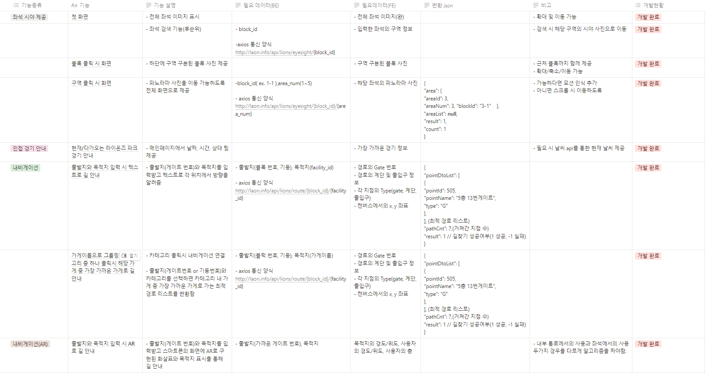
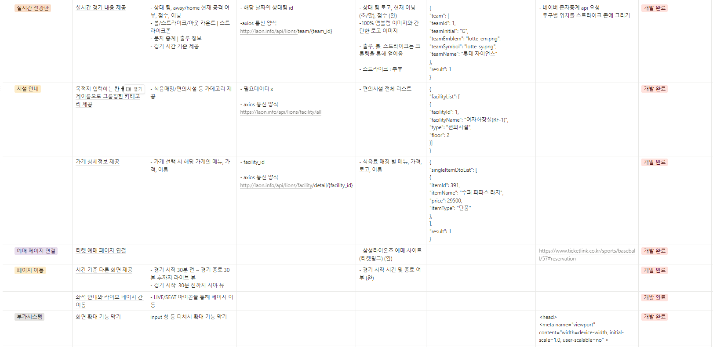
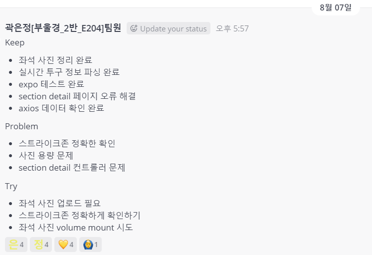
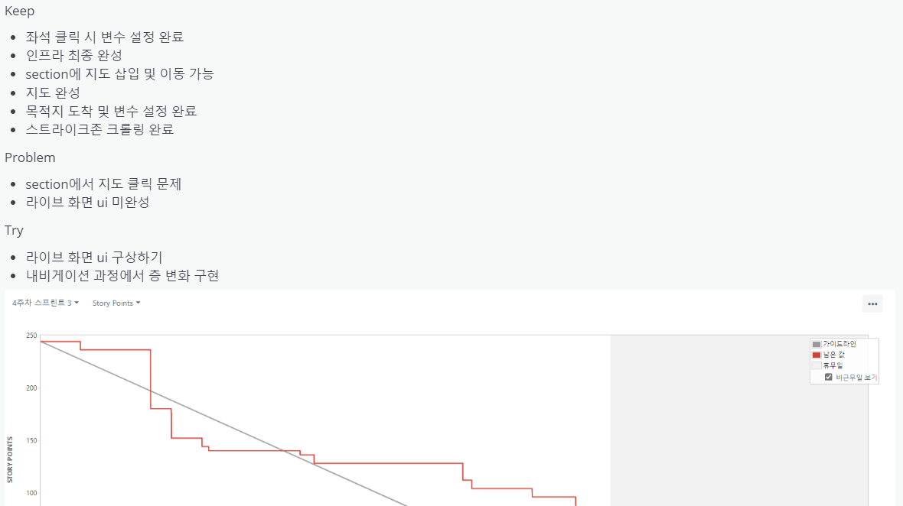
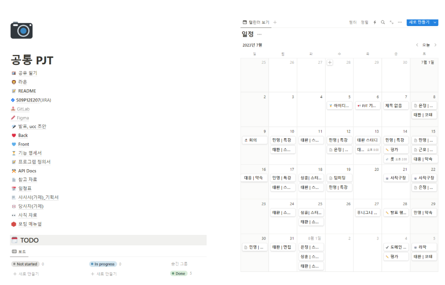

# :baseball: 삼성 라이온즈 파크 직관러들을 위한 맞춤 서비스, LA:ON

 

## 🗒️ 목차

1. [🌈 프로젝트 개요](#🌈-프로젝트-개요)
2. [💡 주요 기능](#💡-주요-기능)
3. [🔧 기술 소개](#🔧-기술-소개)
4. [📝 설계 문서](#📝-설계-문서)
5. [⚙️ PrtingManual](#⚙️-prtingmanual)
6. [👨‍👩‍👧‍👦 팀원 소개 및 역할](#👩‍👩‍👧‍👦-팀원-소개-및-역할)

 
 

## 🌈 프로젝트 개요
- <strong>진행 기간</strong>: 2023.07.10 ~ 2023.08.18
- <strong>프로젝트 목표</strong>
  
  - 삼성 라이온즈 파크 관련 서비스를 제공합니다.
  
  - 삼성 라이온즈 파크 직관러들을 위한 정보를 제공합니다.

 
 

## 💡 주요 기능
“<strong>라온</strong>”은 삼성 라이온즈 파크에 방문하는 직관러들을 위한 서비스 제공 어플리케이션/웹 서비스 입니다.

- <strong>직관 전</strong>
  - 세분화된 구역별 시야를 파노라마 사진을 통해 제공합니다.
  - 다음 경기에 맞는 예매 사이트 이동 서비스를 제공합니다.
  - 구장 내 모든 식음매장 정보 및  가게 별 메뉴를 제공합니다.
  - 다가오는 삼성 라이온즈 파크 경기의 날짜, 상대 팀 정보를 제공합니다.
    
- <strong>직관 중</strong>
  - 실시간 중계 서비스를 통해 이닝, 스코어, 볼카운트, 문자중계, 스트라이크존을 제공합니다.
  - 원하는 식음매장 및 편의 시설 클릭 시, 현 위치를 기반으로 최단 경로를 네비게이션, AR을 통해 안내합니다.

 

### 랜딩/메인페이지

- 입장하기 버튼을 통해 앱을 시작합니다.
- 경기중일때 경기중계화면으로, 경기중이 아닐때는 좌석 안내페이지로 이동합니다.

 

### 기능페이지

> 좌석 안내

        

- 다음 삼성 라이온즈 파크에서의 어웨이 팀을 제공하고, 그에 알맞는 구역별 시야를 파노라마 형태로 제공합니다.
- 해당 경기에 맞는 예매 사이트 이동 서비스를 제공합니다.
- 파노라마 아래 세분화된 구역을 통해 더욱 다양한 시야를 제공합니다.

 

> 경기중계

    

- 경기전의 경우, 삼성 라이온즈 파크 경기가 있는 날의 경기 정보를 알려드립니다.

- 경기중일 경우, 어웨이팀, 이닝, 점수, 문자중계, 볼카운트, 출루정보 그리고 스트라이크 존을 제공합니다.
  
   

> 시설안내

        

- 구장 내 식음시설, 메뉴, 편의시설을 안내합니다.

 

        

- 최적의 경로를 알려주는 네비게이션과 AR을 통해 식음시설과 편의시설까지의 길안내를 제공합니다.

 
 

## :wrench: 기술 소개

### 기술 스택
- Front-end : `React` `JavaScript` `Redux` `AR.js` `HTML5` `CSS`
- Back-end : `JAVA` `Spring Boot` `JPA` `MySQL`
- 협업 Tool : `JIRA` `GitLab` `Notion` `MatterMost`, `Figma`
 

### 주요 기술
- BFS와 우선순위 큐를 통한 최단거리 계산
- GPS 및 AR을 활용한 내비게이션
- WebGL을 활용한 실시간 스트라이크존 및 길 안내

 
 

## 📝 설계 문서

### 기능명세서

### ERD

 

### 시스템 아키텍처

 

### 협업

- 데일리 스크럼 회의를 통해 진행 상황을 공유하였습니다.

- JIRA를 활용하여 일정을 관리하고, 매주 스프린트 회고를 통해 주차별 현황을 파악할 수 있었습니다.

- Notion을 통해 정보 및 공통ㆍ개인 일정을 공유하였습니다.

 
 

## ⚙️ PrtingManual

[⚙️ PrtingManual](https://github.com/eunjng5474/Laon/blob/master/exec/Porting_Manual.pdf)

 
 

## 👩‍👩‍👧‍👦 팀원 소개 및 역할

[FE] 
- <strong>김대웅</strong> : FE 팀장
- <strong>곽은정</strong> : 서기
- <strong>손민영</strong> : 발표

[BE]
- <strong>이상훈</strong> : 팀장
- <strong>정근모</strong> : BE 팀장
- <strong>김태환</strong> : CI/CD
