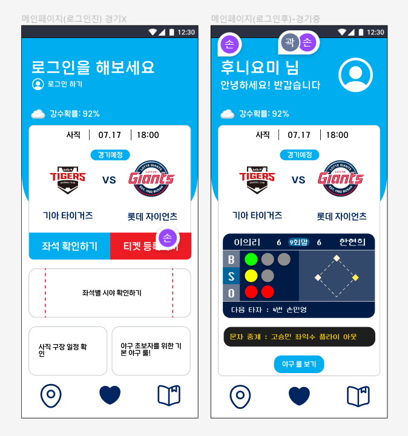
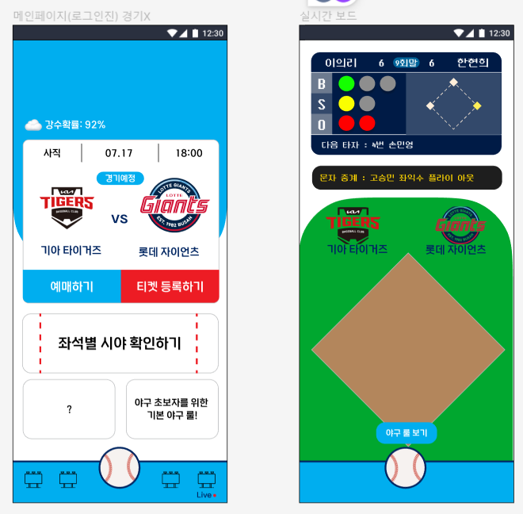
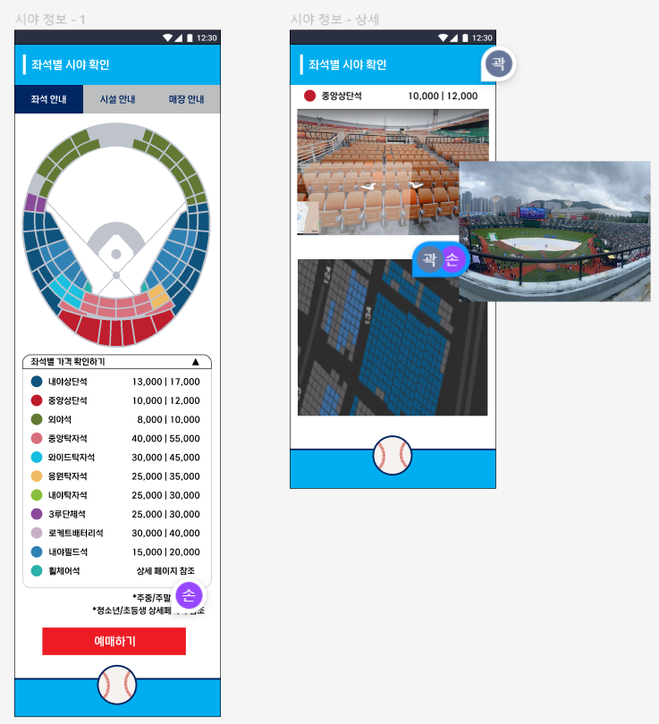
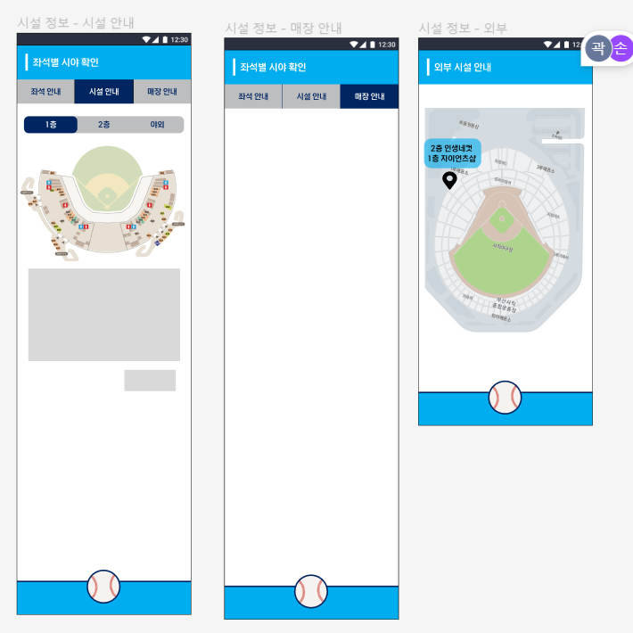

# 프로젝트 회고

### 손민영

> 0717.월 회고

- KEEP
  
  - 프로젝트 시작 후 하루도 빠짐없이 아침마다 스크럼 진행
  
  - Figma를 활용하여 웹/앱 페이지 목업 진행

- Problem
  
  - 다른 일에 미루어 Jira를 활용하지 못했습니다.

- Try
  
  - Figma를 활용하여 목업 진행 완료합시다.
  
  - Jira 진행을 미루지 않고, 진행해봅시다.

> 0718

- 목업 디자인 - 메인페이지
  
  

- 답사를 위한 좌석 분류
  
  - ./좌석분류

> 0719

- 목업 디자인 
  
  - 메인페이지 수정, 실시간 중계 페이지
    
    
  
  - 좌석별 시야
    
    
  
  - 시설 정보
    
    

> 0720

- 목업 디자인 수정

- 프론트 컨포넌트 구조
